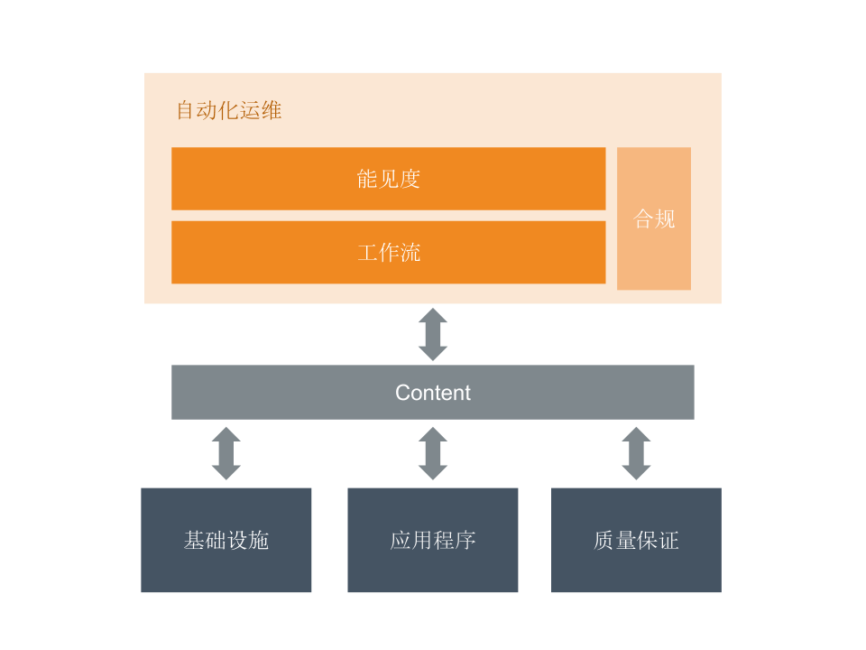
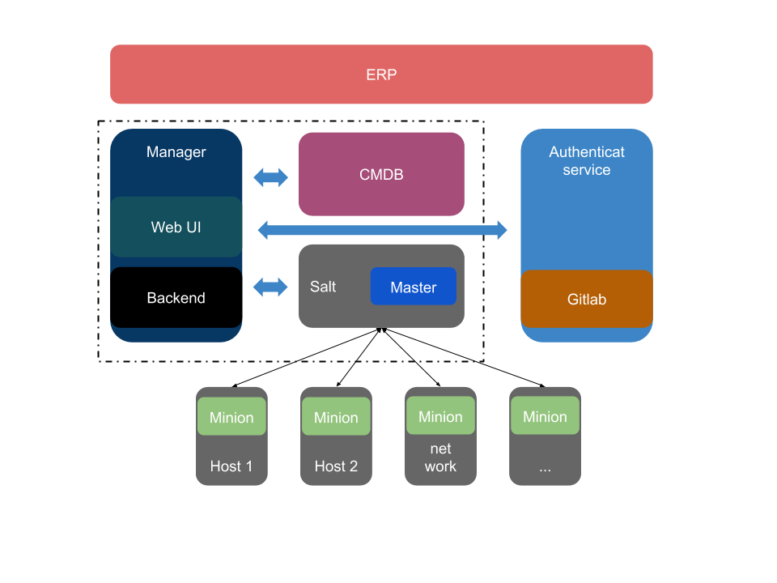

## 概述

### 目的

基础设施：所有和业务无关的系统、设施，包括服务器硬件保障、系统环境维护、安全管理、性能管理等。

应用程序：核心业务的维护，包括业务代码升级、业务数据保障、故障查找和排除等。

质量保证：可用性维护，包括灾备、熔断、事故处理、服务扩容等。

基础设施、应用程序、质量保证是所有运维活动的基石，自动化运维就是要在合规的前提下提供舒适的工作流和能见度。

### 现状
目前公司在自动化运维方面还处于空白的状态，需要一个长期的系统性建设才能达到一个比较理想的状态。
一个较为完善的自动化运维系统一般需要包括以下这些内容：

1. 硬件和网络的自动管理
2. 云化、虚拟机的自动管理
3. 操作系统和软件的自动化安装、配置、升级
4. 常规任务（健康检查、安全加固和检查、备份、清理、数据管理、弹性伸缩等）
5. 手工任务（容灾切换、应急操作、应用部署和起停……）
6. 监控
7. 问题诊断
8. 可视化

其中1、2、3主要是IaaS层关注的工作内容，4、5、6、7、8主要是PaaS层关注的工作内容 ，IaaS层和PaaS层相互结合，共同完成自动化运维。

#### IaaS层
重点是计算、存储、网络的自动化管理。Openstack是IaaS层目前最活跃的一个开源的云计算 IaaS 平台，即云操作系统它是开源云计算平台，类似于AWS、阿里云之类。

#### PaaS层
重点是应用、配置、代码、监控的自动化管理，为应用提供软件部署平台（runtime），抽象掉了硬件和操作系统细节，可以无缝地扩展（scaling）。开发者只需要关注自己的业务逻辑，不需要关注底层。

在现实生产环境中，文件上传需求、配置变更需求、软件升级等需求占用了维护人员大量的时间，所以这也是我们迫切需要自动化的地方。

这一层有很多工具，开源的主要有：ansible和salt。从功能上来说，它们都能满足我们的需求，下表是它们的一些主要差异。

| 项目 | ansible | saltstack |
| ----------- | ----------- | ----------- |
| 架构 | 使用ssh协议，无需代理部署和通信。 |主从结构，需要在目标机部署客户端，master和minion之间通过ZeroMQ建立持久化连接。|
| 速度 | 比较慢，根据网上的实践效果，适合500台服务器以下的场景。 |非常快，支持同时操作数万台服务器。|
| 安全 | 基于ssh协议。 |自有协议，通过AES加密。|
| 用户界面 | cli，外加社区版的web UI（AWX） |cli， 一些第三方的web UI|
| 学习曲线 | 运行方式直观，容易理解。 |更加模块化，易于组织代码结构，但是完全精通Salt需要更多学习。|

这里还要提一下另一项非常流行的技术：应用容器。
这是一种轻量级、可移植、自包含的软件打包技术，使应用程序可以在几乎任何地方以相同的方式运行。开发人员在自己笔记本上创建并测试好的容器，无需任何修改就能够在生产系统的虚拟机、物理服务器或公有云主机上运行。
它可以用在laaS层和PaaS层，我们这里更适合用在PaaS层，配合相应的自动化工具比如Kubernetes、Docker Swarm、 DC/OS来对资源进行管理。

结合公司实际，对上述内容做以下取舍：
* IaaS层的自动化涉及大量底层设施，任何改动都会伤筋动骨，再没有足够必要性之前，可以暂时维持现状，将openstack纳入备忘录。
* PaaS层的自动化，这是我们需要重点实施的地方。
* 容器技术，虽然有很多好处 ，但是它对开发人员有一定的学习曲线，并且可能会涉及原有软件的架构调整(微服务架构)。考虑到开发资源有限，而且也不会显著影响我们实施PaaS层的自动化方案，所以这里作为可选项，等时机成熟后再考虑实施。

## PaaS层总体设计方案

考虑到性能，这里选用salt作为PaaS层自动化运维的底层关键工具，配合自行开发的CMDB和综合管理系统（Manager）来达成自动化目标。

 

ERP：这里是外部流程控制类系统，如我们目前使用的企业微信、（项目管理）jira等，考虑到公司目前的管理流程的规范还在建设中，jira也刚刚开始使用，面临很多不确定因素，所以和这类系统的接驳暂时先不做。

CMDB：是整套系统的资源管理数据库，与业务，人员，组织，资产，流程等多方面相关的元数据最终都会入库。
Manger：控制中心，整个系统的核心，通过控制salt和CMDB，为用户提供所有的业务逻辑和人机交互功能。

Authenticat service：这里使用gitlab作为Oauth2.0的提供者，配合这次对gitlab项目的整理，可以获取较高质量的员工和项目信息。

gitlab：代码仓库。

Master：salt工具的管理端，此系统用于将命令和配置发送到在受管系统上运行的Salt minion。

Minion：被控端，从Salt master接收命令和配置。

### 功能定义
#### CMDB
设计合理的数据模型，存放系统变量和用户变量
* 系统变量：主要是底层受管系统的静态信息，包括操作系统，内存和许多其他系统属性，以及自定义系统变量
* 用户变量：用户定义的变量，诸如端口，文件路径，配置参数和密码之类的值。

#### Manger
主要实现以下功能模块
* 用户管理
* 项目管理
* 资产管理
* 权限管理
* 配置管理
* 发布部署功能
* 日志审计功能

### 实施方案
Manger和CMDB虽然是两个模块，但是实际实施中是可以并入一个项目进行开发。

#### 开发基础
基于以下考量，基于较为底层的工具，自行开发上层管理、调度平台。
1. 为什么不用现有的jumpserver？ 
    现有的jumpserver，虽然有部分上面提到的类似功能，如资产管理，但它的数据需要手动或者通过api录入，而我们的方案是主机部署Minion以后，可以直接获取所有的数据。
    jumpserver强调通过ssh直接登陆服务器操作命令，同时提供完善的审计功能，但是对于自动化系统来说，人工手动通过ssh操作服务器是不必要的，甚至是有害的。
    jumpserver的远程命令执行功能是通过ansible来实现的，与我们的方案有较大差距。

2. 有没有其它合适的开源管理系统？
    目前还没找到，要么系统过于庞大，流程复杂，难以定制；要么是活跃度差，缺少维护。

#### 主要技术路线
数据库：postgresql + redis
后端：django + django-restful + celery + websocket
前端：react + react-admin 或者vue + vue-admin

